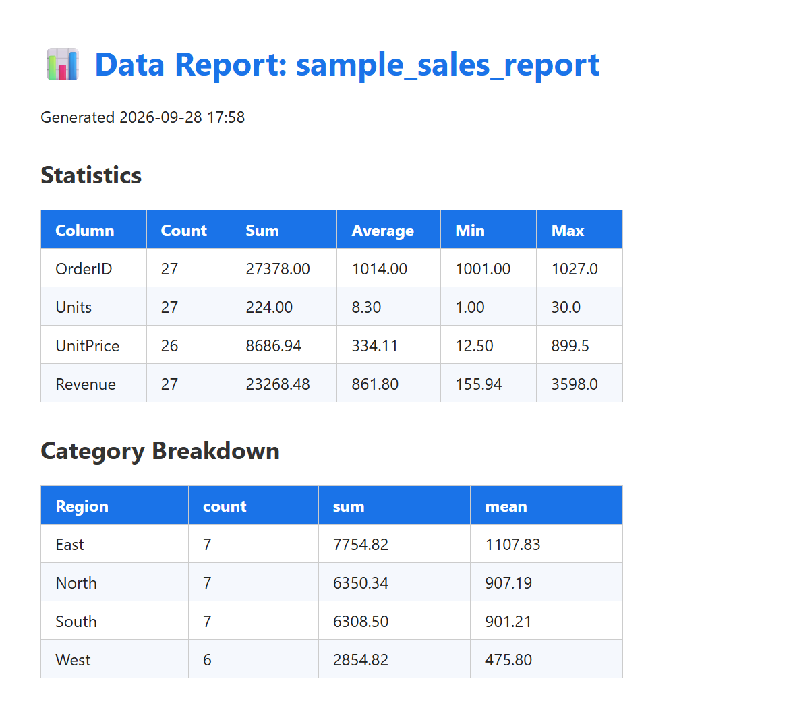

# 📊 Excel / CSV Report Automator

A Python tool that turns messy spreadsheet data into a clean, professional report — automatically.

## 📸 Screenshot



## ✨ Features

- **Loads any CSV or Excel file** (.csv, .xlsx, .xls)
- **Automatic data cleaning**
  - Trims whitespace from text fields
  - Removes duplicate rows
  - Parses messy/mixed date formats (`2025-01-05`, `01/08/2025`, `January 15, 2025`)
  - Flags and counts blank cells
- **Summary statistics** for every numeric column (sum, average, min, max)
- **Category breakdowns** — group any value column by any category (e.g., Revenue by Region)
- **Outputs**
  - Formatted multi-sheet Excel report with a built-in bar chart
  - Colorful console summary
  - Optional self-contained HTML report (open in any browser)

## 🚀 Usage

```bash
# Install dependencies
pip install -r requirements.txt

# Basic: clean data + get statistics
python report_automator.py --input data.csv

# Group analysis: Revenue by Region
python report_automator.py --input sales.xlsx --category Region --value Revenue

# Also generate an HTML report
python report_automator.py --input data.csv --html

# Custom output path
python report_automator.py --input data.csv --output reports/monthly.xlsx
```

## 📂 Output

Running on `sample_sales.csv` produces:
- `sample_sales_report.xlsx` — sheets: **Summary** (with chart), **Statistics**, **Breakdown**, **Cleaned Data**
- `sample_sales_report.html` — printable, shareable report

## 🔧 Requirements

- Python 3.10+
- pandas
- openpyxl

## 💡 Example

The included `sample_sales.csv` is intentionally messy — duplicate rows, extra spaces, mixed date formats, and missing values — to demonstrate the cleaning pipeline in action.
